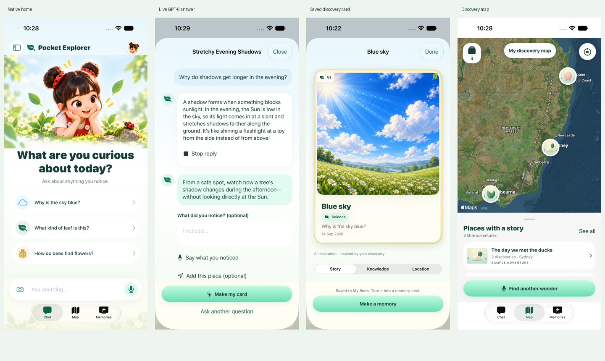

# Native implementation review

The Miro-based iPhone prototype is implemented and verified locally. The Cloudflare backend is deployed and independently verified. TestFlight 0.1.0 (9) was uploaded from this Mac using Xcode 27 RC (27A266a) and is independently confirmed VALID / IN_BETA_TESTING in Hackathon Internal.

## Available experience

- Native illustrated Chat home, text and voice entry, optional camera/photo input and age-aware live AI answers.
- Persistent questions, generated card artwork, collection search/categories, card reversal and personal observations.
- Satellite map with selectable image markers and optional private locations.
- Memories, gentle later quizzes and revocable public-link sharing with generated artwork.
- Explicit English, Simplified Chinese or device-language selection. No parental key or approval gate.

## Verified results

| Check | Result |
| --- | --- |
| Final 375pt native regression with Xcode 27 RC | 54 passed, zero failures/skips, 90.87% app line coverage |
| iOS 27 large screen | 48 passed, system Reduce Motion enabled, later home touch-target check passed |
| Native live AI | Real GPT-6 response matched independent app-journal and D1 reads |
| Backend | 48 tests, 98.94% lines, 95.73% branches |
| Web | Seven browser tests, two generated-artwork tests and the live deployment test passed |
| Production Cloudflare | Real question, queued image, private/public image reads and revocation passed. Final GitHub deployment is verified |
| Local archive | 0.1.0 (9) released locally, Apple VALID and internal group independently confirmed |

The screenshots show separate verification scenarios. The shadow answer is live GPT-6. The card screenshot reuses a previously generated Azure image through the native fixture server. A separate real workerd run verified actual queued generation. Three local image requests and one production image request were made in this iteration.

## Remaining human review

Review physical iPhone speech, speaker, camera, VoiceOver and mobile Safari. Simulator evidence does not replace these checks.

Accounts, friends, cross-account chat and card version history are deferred. V1 is a visual badge. Detailed evidence is in [miro-live-ai.json](evidence/miro-live-ai.json), with current execution state in [TODO](../TODO.md).
